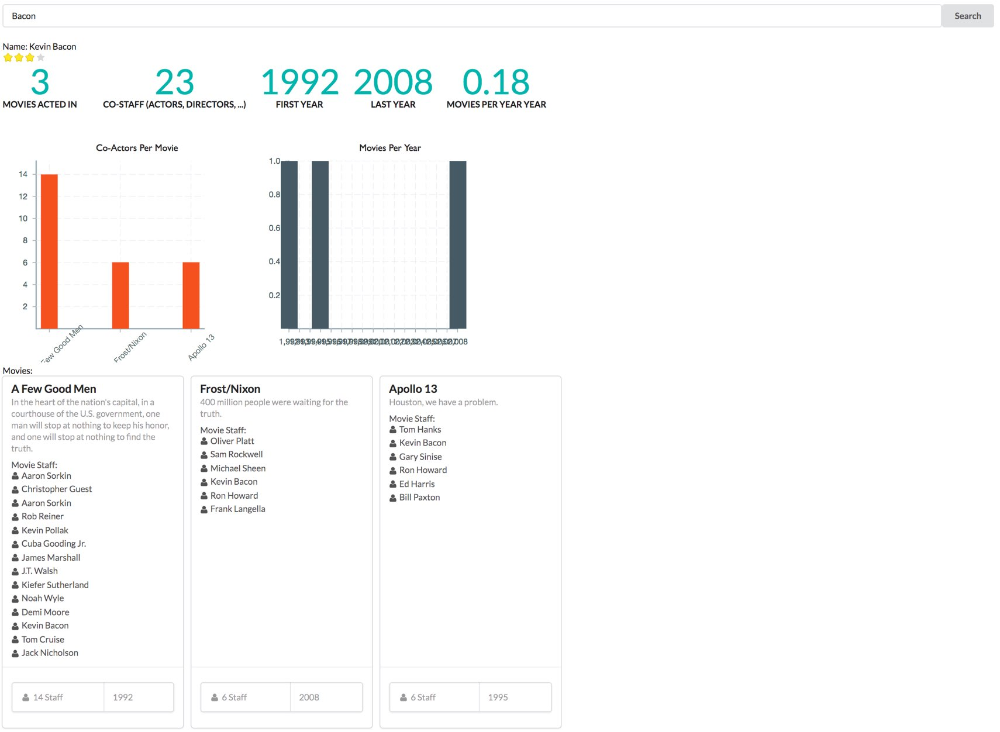

# graph-app-demo-charts

Simple Graph App Demo show how to render Cypher results as a dashboard using Semantic UI and Victory React components.

Using javascript neo4j-driver to execute a Cypher statement with the actor name as a parameter.



## Install

### Neo4j

You'll need a Neo4j instance with the movies `:play movie graph` dataset installed.

### Webapp

Currently, the app assumes the endpoint is available at `bolt://localhost:7687/`

```
npm install
npm start
```


### Useful Links

* https://formidable.com/open-source/victory/docs/
* https://react.semantic-ui.com/elements
* https://semantic-ui.com/views/card.html
* https://www.npmjs.com/package/neo4j-driver
* https://github.com/neo4j-apps
* https://github.com/neo4j-apps/graph-app-starter
* https://github.com/neo4j-apps/graph-app-kit/
* https://neo4j.com/developer/cypher